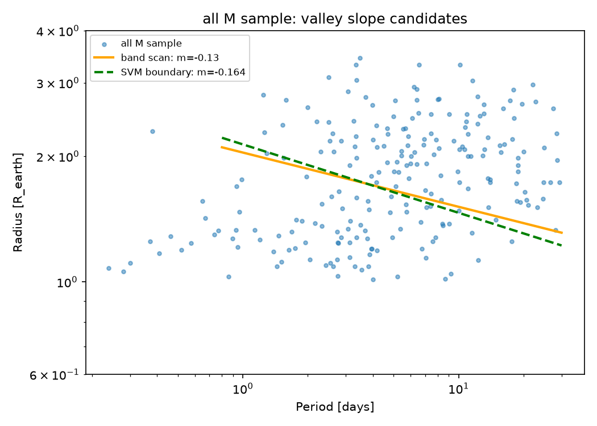

# Revisiting-the-M-dwarf-Radius-Valley-Slope
An undergraduate archival research project measuring the slope of the small-planet radius valley around M dwarfs, using the 2026 NASA Exoplanet Archive — and probing why published measurements of this slope disagree in sign.
# Revisiting the M-dwarf Radius Valley Slope

An undergraduate archival research project measuring the slope of the
small-planet radius valley around M dwarfs, using the 2026 NASA Exoplanet
Archive — and probing why published measurements of this slope disagree
in sign.

**Author:** Cho Seunghyeon ([email protected])



*Two independent estimators — a rotating-band density scan (solid) and an
SVM boundary fit (dashed) — converge on a negative valley slope for the
combined M-dwarf sample.*

---

## The question

The radius valley is a deficit of planets near 1.5–2.0 R⊕ that separates
rocky super-Earths from gas-enveloped sub-Neptunes (Fulton et al. 2017).
Around FGK stars its slope in the period–radius plane is
m = d log Rp / d log P ≈ −0.11, consistent with atmospheric mass loss.
Around M dwarfs, however, the literature disagrees:

| Study | Slope | Interpretation |
|---|---|---|
| Cloutier & Menou (2020) | **+0.058 ± 0.022** | gas-poor formation |
| Van Eylen et al. (2021) | **≈ −0.11** | mass loss, same as FGK |
| Recent occurrence work | valley may vanish for mid–late M | — |

This project asks: **which sign does the 2026 confirmed-planet catalog
favor, and how much does the answer depend on analysis choices?**

## Key findings

1. **The radius distribution around mid-to-late M dwarfs
   (M★ < 0.4 M☉) is unimodal**, peaking near 1.2 R⊕, and robust to
   radius-precision cuts (100% → 8%). No valley is resolved, so no slope
   is defined for this bin.
2. **The super-Earth / sub-Neptune count ratio rises monotonically toward
   low stellar mass** (0.39 for F → 1.49 for mid-late M), consistent with
   a valley that fades at the lowest masses.
3. **Hartigan's dip test fails to reject unimodality even for the G
   control sample where a valley is evident** — despite 93% power on
   matched synthetic bimodal data. The inclined valley, superposed over
   many periods, defeats 1-D tests; this motivates measuring the slope
   directly.
4. **Two independent estimators return negative slopes for the combined
   M-dwarf sample**: band scan m = −0.13 (95% CI [−0.23, +0.07]) and SVM
   boundary m = −0.16 (95% CI [−0.28, −0.02]). The G/K controls reproduce
   published FGK values (G: −0.09, matching Van Eylen et al. 2018).
5. **The inferred slope — even its sign — depends on methodological
   choices.** Narrowing the band half-width flips the band-scan sign;
   soft SVM margins (C = 0.1) produce pathological boundaries rejected by
   a pre-defined validity criterion; and an *unconstrained* gap search
   locks onto the detection-completeness edge (m ≈ +0.46) instead of the
   valley. We suggest this sensitivity contributes to the literature
   disagreement.

**Bottom line:** the current catalog *favors* the negative (mass-loss)
sign but cannot decisively exclude the positive value; the measurement is
method-sensitive, and honest reporting of that sensitivity is part of the
result.

## Repository contents

```
.
├── final.py   # full analysis pipeline (stages [1]–[9])
├── report/
│   ├── radius_valley.tex       # AASTeX 7 report source
│   ├── radius_valley.pdf       # compiled report
│   ├── aastex701.cls           # AASTeX class (patched: ulem/epsf bypassed)
│   └── aasjournalv7.bst
├── figures/                    # generated by the pipeline
│   ├── fig1_error_cuts.png
│   ├── fig2_se_sn_ratio.png
│   └── fig3_slope_overlay.png
└── exoplanet_archive_2026-07-06.csv
```

## Running the pipeline

```bash
pip install pandas numpy matplotlib diptest scikit-learn
python final.py
```

The script downloads the current NASA Exoplanet Archive
`pscomppars` table via TAP (or reuses a same-day cached CSV), then runs
every analysis stage in order, printing tables to the console and saving
figures to `figures/`. Stages:

| Stage | What it does |
|---|---|
| [1]–[2] | TAP download; sample cuts (R < 4 R⊕, P < 100 d); stellar-mass bins |
| [3] | radius-precision cut experiment (Fig. 1) |
| [4]–[5] | gap-depth statistic D with bimodality guard + bootstrap |
| [6] | Hartigan dip test + power simulation |
| [7] | super-Earth/sub-Neptune ratio (Fig. 2) |
| [8]–[8b] | rotating-band slope scan + half-width sensitivity |
| [8c] | SVM boundary slope + 3×3 hyperparameter sensitivity with validity criterion |
| [9] | overlay figure (Fig. 3) |

Reproducibility notes: the random seed is fixed (`rng = default_rng(42)`);
bootstrap resampling preserves each planet's (P, R) pairing; the archive
snapshot is cached with the download date in the filename. Results in the
report correspond to the snapshot of 2026-07-06.

## Method summary

- **Valley model:** R = R₀ · (P / 10 d)^m in the log P–log R plane.
- **Band scan:** grid search over (m, R₀) for the band most depleted
  relative to its flanks (half-width 0.04 dex).
- **SVM boundary:** linear soft-margin SVM separating planets above/below
  a mass-scaled dividing line (Van Eylen et al. 2018 approach); slope
  m = −w₀/w₁; labels re-fit iteratively.
- **Mass-scaled valley location:** R_valley = 1.86 (M★/M☉)^0.18
  (Petigura et al. 2022) — the one literature constant used throughout.
- **Uncertainties:** paired bootstrap (2000 draws for distribution
  statistics, 500 for slopes).

## Limitations

Raw counts are **not** completeness-corrected (no injection–recovery);
cross-type comparisons are qualitative, and the bias direction is stated
wherever it matters. The combined M sample is small (n = 225 after cuts).
F-type results are reported but not trusted (small planets are heavily
selection-suppressed around hot stars).

## Report

The full write-up (AASTeX 7, 5 pages) is in [`report/radius_valley.pdf`](report/radius_valley.pdf):
introduction, data, methods, results, and discussion, including the
argument that methodological sensitivity — not only astrophysics — may
underlie the published disagreement.

## References

Fulton et al. 2017, AJ 154, 109 · Fulton & Petigura 2018, AJ 156, 264 ·
Van Eylen et al. 2018, MNRAS 479, 4786 · Owen & Wu 2017, ApJ 847, 29 ·
Cloutier & Menou 2020, AJ 159, 211 · Van Eylen et al. 2021, MNRAS 507, 2154 ·
Petigura et al. 2022, AJ 163, 179

## Data source

NASA Exoplanet Archive, Planetary Systems Composite Parameters
(`pscomppars`): https://exoplanetarchive.ipac.caltech.edu/

**Getting the data.** Three options:

1. **Use the cached snapshot in this repo** —
   `exoplanet_archive_2026-07-06.csv` is the exact snapshot used for every
   number in the report. Place it next to the script and the pipeline will
   reuse it (same-day caching is by filename; to force reuse of this
   snapshot on a later date, pass it to `pd.read_csv` directly or rename it
   to today's date).
2. **Let the pipeline download fresh data** — running
   `python radius_valley_pipeline.py` with no cache present queries the
   archive's TAP service automatically and saves a new dated CSV. Note that
   the archive is updated continuously, so a fresh snapshot will differ
   slightly from the 2026-07-06 one and results will shift accordingly.
3. **Manual download from the website** — go to the archive, open
   *Data → Planetary Systems Composite Parameters*, and use *Download
   Table*. The pipeline needs at least these columns: `pl_name`,
   `pl_rade`, `pl_radeerr1`, `pl_radeerr2`, `pl_orbper`, `st_mass`
   (plus `tran_flag = 1` filtering, which the TAP query in
   `download_archive()` applies for you).

This research has made use of the NASA Exoplanet Archive, which is
operated by the California Institute of Technology, under contract with
the National Aeronautics and Space Administration under the Exoplanet
Exploration Program.
